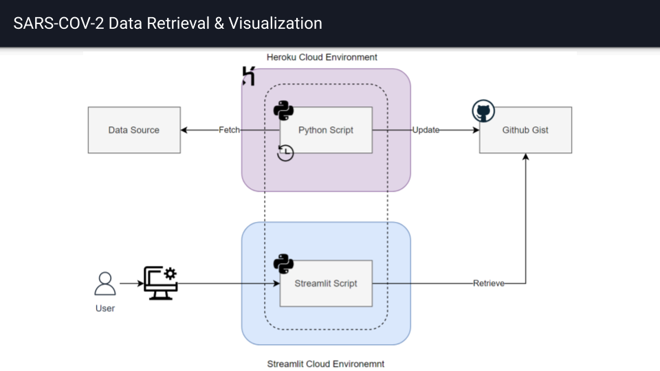

# Monitoring SARS-COV-2 Outbreak in Jalisco, MX

This repository contains a simple python implementation to
monitor the SARS-COV-2 Outbreak in Jalisco, MX. The project
consists on two parts:
* `data-retrieval` - get and curate the latest available data provisioned by an official mexican source.
* `data-visualization` - enable a public interactive dashboard with a simple visualization of the latest data.



## Local setup

You can clone [the repo](https://github.com/RHDZMOTA/sars-cov-2-mx) and execute this project in your local computer.

```commandline
$ git clone https://github.com/RHDZMOTA/sars-cov-2-mx
```

Create copy of the `.env.example` file: `cp .env.example .env`
* Replace the `COV_GIST_ID` with an ID of your own github gist that will be used to store the latest data.
* Replace the `COV_TOKEN` with a valid [github token](https://github.com/settings/tokens).

Load the configuration variables with:

```commandline
$ export $(cat .env | xargs)
```

Create a Python virtualenv (e.g., `python -m virtualenv venv`) and install the dependencies:
1. Activate the virtualenv:
  * MacOS/Unix: `source venv/bin/activate`
  * Windows: `source venv/Scripts/activate`
2. Install the dependencies:
  * `pip install -r requirements.txt`

If everything is correctly configured, you should be able to download the latest data into your gist by running:

```commandline
$ COV_DEFAULT_LOGLEVEL=INFO python update_gist.py
```

Once you have data in your gist, start the streamlit dashboard by running:

```commandline
$ streamlit run dashboard.py
```
